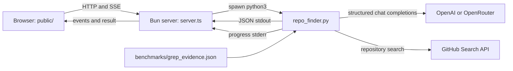

# System Architecture

> Category: Architecture | Version: 1.0 | Date: August 2026 | Status: Active

How the local Bun web shell, browser UI, Python discovery engine, and external services fit together.

**Related:**
- [Search and retrieval pipeline](../search/search-retrieval-pipeline.md)
- [Local web and SSE jobs](../web/local-web-sse-jobs.md)
- [Provider and credential model](../security/provider-credential-model.md)
- [Developer operations and testing](../operations/developer-operations-testing.md)

---

## Topology

The Python module is the discovery engine and CLI. It expands a topic, performs GitHub searches, optionally merges imported Grep evidence, adapts the query set, and asks the selected model to rank candidates (`repo_finder.py:227-241`, `repo_finder.py:402-441`).

The Bun server is a local process boundary rather than a second search implementation. It validates requests, starts the Python CLI, translates stderr lines into progress events, parses stdout as the final result, and serves three static assets (`server.ts:81-118`, `server.ts:189-216`). Jobs and subscribers exist only in the server process (`server.ts:11-22`).

The browser creates a job, follows its event stream, renders ranked evidence using DOM text nodes, and can cancel the active job (`public/app.js:69-129`, `public/app.js:140-208`).

## Data and trust boundaries

- Model schemas constrain expansion, adaptive-query, and ranking responses; candidate metadata and snippets are explicitly labeled untrusted in ranking prompts (`repo_finder.py:30-72`, `repo_finder.py:329-345`, `repo_finder.py:383-399`).
- GitHub and model traffic leaves the local machine; the browser talks only to the loopback Bun server, whose hostname is fixed to `127.0.0.1` (`server.ts:195-199`).
- Grep evidence is a checked-in JSON import boundary for this prototype, not a live MCP call (`README.md:53-55`, `repo_finder.py:348-380`).
- The server bounds request bodies at 4 KB and process output at 5 MB and applies CSP, referrer, and MIME-sniffing headers (`server.ts:7-9`, `server.ts:24-29`, `server.ts:52-78`, `server.ts:121-145`).

## Persistence and lifecycle

There is no database or durable job queue. The in-memory map keeps event history for SSE replay; completed or failed jobs are scheduled for deletion after 15 minutes (`server.ts:39-49`, `server.ts:109-118`, `server.ts:153-177`). A server restart loses all jobs.

## Source map

- `repo_finder.py` — discovery, external API calls, ranking, and CLI.
- `server.ts` — static server, subprocess jobs, SSE, and cancellation.
- `public/` — browser form, progress, and evidence rendering.
- `tests/test_repo_finder.py` — Python unit tests.
- `benchmarks/` — three-topic benchmark runner and imported evidence.
