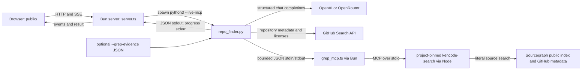

# System Architecture

> Category: Architecture | Version: 1.1 | Date: August 2026 | Status: Active

How the local Bun web shell, Python discovery engine, live KenCode MCP bridge, browser UI, and external services fit together.

**Related:**
- [Search and retrieval pipeline](../search/search-retrieval-pipeline.md)
- [Local web and SSE jobs](../web/local-web-sse-jobs.md)
- [Provider and credential model](../security/provider-credential-model.md)
- [Developer operations and testing](../operations/developer-operations-testing.md)

---

## Topology

The Python module is the discovery engine and CLI. It creates an intent/search plan, performs licensed GitHub
searches, runs validated literal probes through the bridge, optionally merges explicitly file-based evidence, and
asks the selected model to rank only the open-source set (`repo_finder.py:279-343`, `repo_finder.py:637-688`,
`repo_finder.py:712-785`).

The Bun server is a local process boundary rather than a second search implementation. It validates requests, starts
the Python CLI with `--live-mcp`, translates stderr lines into progress events, parses stdout as the final result, and
serves static assets (`server.ts:108-146`, `server.ts:189-216`). Jobs and subscribers exist only in its process.

The browser creates a job, follows its event stream, renders repository licenses and exact metadata/live/file evidence
labels with DOM text nodes, and can cancel the active job (`public/app.js:73-99`, `public/app.js:102-165`).

## Data and trust boundaries

- Model-generated probes are validated in Python and again in the bridge before they reach MCP (`repo_finder.py:335-343`, `grep_mcp.ts:42-58`).
- MCP output is treated as untrusted: labeled blocks, repository names, HTTPS GitHub blob links, snippets, result counts, and SPDX identifiers are bounded and revalidated on both sides (`grep_mcp.ts:60-123`, `repo_finder.py:559-634`).
- Python invokes Bun with an argv array, a 120-second timeout, a 2 MB output cap, and a restricted environment. The bridge forwards only documented `CFM_*` settings and maps `GITHUB_TOKEN` to `CFM_GITHUB_TOKEN` when needed (`repo_finder.py:544-675`, `grep_mcp.ts:141-149`).
- GitHub and KenCode candidates must be non-private and carry a recognized SPDX identifier before ranking (`repo_finder.py:350-432`, `repo_finder.py:752-756`).
- GitHub, Sourcegraph, and model traffic leaves the local machine; the browser talks only to the loopback Bun server.
- The server bounds request bodies at 4 KB and process output at 5 MB and applies CSP, referrer, and MIME-sniffing headers (`server.ts:7-9`, `server.ts:24-29`, `server.ts:52-78`, `server.ts:121-145`).

## Persistence and lifecycle

There is no database or durable job queue. The in-memory map keeps event history for SSE replay; completed or failed jobs are scheduled for deletion after 15 minutes (`server.ts:39-49`, `server.ts:109-118`, `server.ts:153-177`). A server restart loses all jobs.

## Source map

- `repo_finder.py` — discovery, license gate, bridge invocation, external APIs, ranking, and CLI.
- `grep_mcp.ts` — bounded MCP stdio client and labeled-output parser.
- `server.ts` — static server, subprocess jobs, SSE, and cancellation.
- `public/` — browser form, progress, license, and evidence rendering.
- `tests/grep_mcp.test.ts` and `tests/test_repo_finder.py` — bridge/parser and Python boundary tests.
- `benchmarks/` — three-topic benchmark runner and optional file-based evidence.
