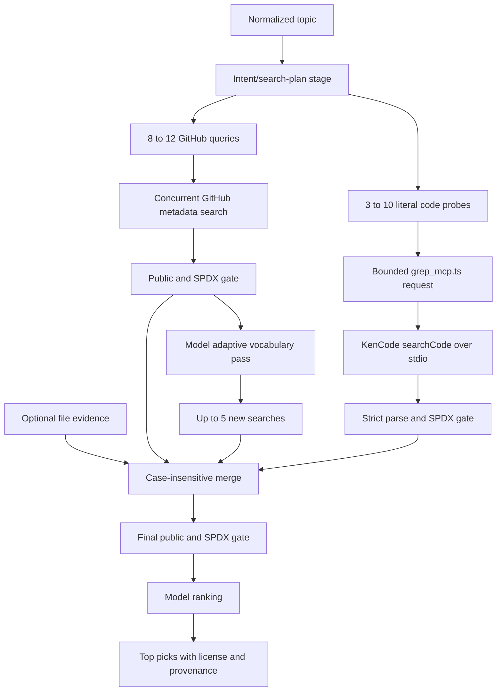

# Search and Retrieval Pipeline

> Category: Search | Version: 1.2 | Date: August 2026 | Status: Active

The recall-first path from a topic to licensed, evidence-bearing, model-ranked repository picks.

**Related:**
- [System architecture](../architecture/system-architecture.md)
- [Provider and credential model](../security/provider-credential-model.md)
- [Developer operations and testing](../operations/developer-operations-testing.md)

---

## Pipeline

1. The topic is whitespace-normalized and limited to 200 characters (`repo_finder.py:799-804`).
2. `create_search_plan()` requests 1–4 interpretations, 1–10 technical concepts, 8–12 distinct GitHub queries, and
   3–10 literal probes under a strict schema (`repo_finder.py:37-46`, `repo_finder.py:279-315`).
3. Query and probe validators bound lengths, reject unsupported query syntax, and reject generic probes before I/O
   (`repo_finder.py:318-343`).
4. GitHub searches run concurrently. Forks, private rows, malformed metadata, and missing/unrecognized SPDX licenses
   are excluded; archived, inactive, low-star, and multilingual licensed repositories remain eligible
   (`repo_finder.py:370-452`).
5. The adaptive pass sees up to 100 first-wave records and may add five genuinely new validated queries
   (`repo_finder.py:476-492`).
6. With live MCP enabled, Python invokes the bridge once with all probes. The bridge calls `searchCode` sequentially,
   parses only documented labels, and bounds each request, result set, file, link, snippet, error, and timeout
   (`repo_finder.py:637-688`, `grep_mcp.ts:42-123`, `grep_mcp.ts:163-206`).
7. Optional `--grep-evidence` rows remain file-based. They are validated and bounded but do not rank alone without a
   recognized license (`repo_finder.py:495-541`).
8. Metadata, live code, and file rows merge case-insensitively. The final merged set passes the open-source gate again
   before ranking (`repo_finder.py:455-473`, `repo_finder.py:752-756`).
9. The ranking model receives at most 100 bounded records, ignores stars as a ranking signal, and returns only names
   already in the candidate set (`repo_finder.py:691-709`).

## License eligibility

`is_open_source()` requires that `public` is not explicitly false and that `license` matches the SPDX identifier
shape while excluding `NOASSERTION` and `OTHER` (`repo_finder.py:350-367`). GitHub and KenCode both supply license
metadata before ranking. This intentionally reduces recall: repositories with no recognized license are public to
view but not safely reusable as open source.

## Failure and retry behavior

GitHub network failures retry; 403/429 handling honors retry headers with a bounded wait, and a 401 from an optional
GitHub token retries anonymously (`repo_finder.py:141-182`, `repo_finder.py:370-388`). Per-query failures remain in
`query_failures`.

Live code evidence is fail-soft but explicit:

- `loaded`: one or more valid matches and no probe failures;
- `no-matches`: every probe completed with zero valid matches;
- `partial`: valid matches plus one or more probe failures;
- `error`: missing runtime, timeout, malformed/global bridge response, or failures with no matches;
- `disabled`: caller deliberately omitted live MCP.

The MCP status and keyed failures are returned in `code_evidence`; a code-evidence error does not discard licensed
GitHub metadata (`repo_finder.py:637-688`, `repo_finder.py:736-740`).

## Output contract

The result includes the original request, full search plan, first/adaptive queries, probes, `code_evidence`,
`static_evidence`, merged eligible-candidate count, query failures, elapsed time, and picks. Each pick exposes its
repository URL, recognized `license`, archive/stale flags, `evidence_type`, matching queries, and bounded evidence
rows whose `source` is `kencode-search` or `file` (`repo_finder.py:757-785`).

`evidence_type` remains structural: `metadata-match`, `code-match`, or `both`. The evidence row's `source` distinguishes
live KenCode from deliberately loaded files, preventing pre-captured benchmark data from appearing live.
