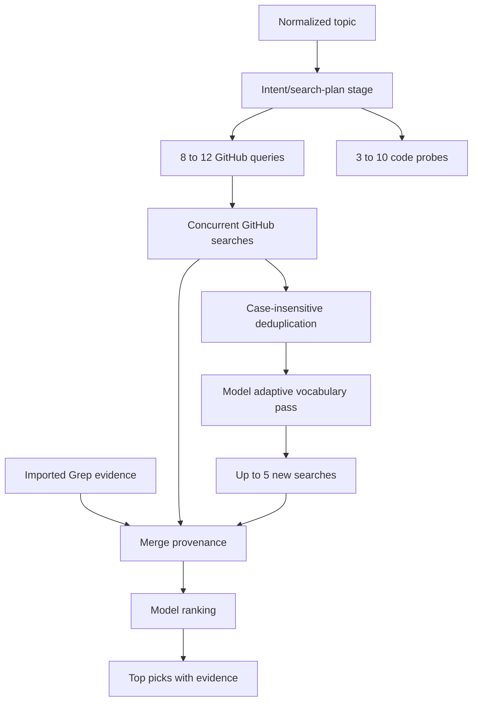

# Search and Retrieval Pipeline

> Category: Search | Version: 1.1 | Date: August 2026 | Status: Active

The recall-first path from a topic to evidence-bearing, model-ranked repository picks.

**Related:**
- [System architecture](../architecture/system-architecture.md)
- [Provider and credential model](../security/provider-credential-model.md)
- [Developer operations and testing](../operations/developer-operations-testing.md)

---

## Pipeline

1. The topic is whitespace-normalized and limited to 200 characters (`repo_finder.py:444-462`).
2. `create_search_plan` requests interpretations, 1–10 technical concepts, 8–12 distinct GitHub queries, and 3–10 literal code probes under a strict JSON schema (`repo_finder.py:31-41`, `repo_finder.py:264-295`). `expand_topic` is a backward-compatible alias (`repo_finder.py:298-300`).
3. Query normalization removes any supplied fork filter and appends `fork:false`; generated queries are length-bounded (`repo_finder.py:218-224`). Searches run concurrently, with four workers by default (`repo_finder.py:299-314`).
4. GitHub results exclude actual forks but retain archived, inactive, low-star, and multilingual candidates. Candidate records retain every matching query (`repo_finder.py:255-296`, `repo_finder.py:317-326`).
5. The adaptive pass sees up to 100 first-wave records and may add at most five genuinely new queries based on missed ecosystem vocabulary; it uses `validate_github_query()` to reject unsupported syntax (`repo_finder.py:409-425`, `repo_finder.py:463-481`).
6. Optional Grep evidence is validated as `owner/repo` plus a matching GitHub blob URL, and snippets are truncated to 500 characters (`repo_finder.py:348-380`). Metadata and code candidates merge case-insensitively; provenance becomes `metadata-match`, `code-match`, or `both` (`repo_finder.py:92-96`, `repo_finder.py:317-326`).
7. The ranking model receives bounded evidence records, ignores stars as a ranking signal, labels each pick's role and focused/partial match, and may translate descriptions (`repo_finder.py:108-120`, `repo_finder.py:383-399`). Only candidate names already in the merged set are accepted.

## Failure and retry behavior

HTTP responses are capped at 5 MB. Network failures may retry; GitHub 403/429 handling honors `Retry-After` or rate-limit reset and caps waits at 120 seconds. A 401 caused by an optional GitHub token is retried anonymously (`repo_finder.py:123-167`, `repo_finder.py:255-273`). Individual GitHub query failures are retained in `query_failures` rather than aborting the entire concurrent wave (`repo_finder.py:299-314`, `repo_finder.py:419-427`). Model/API errors become `RepoFinderError` and terminate the CLI with exit code 1 (`repo_finder.py:170-215`, `repo_finder.py:454-466`).

## Output contract

The JSON result contains the original request text, the full search plan (interpretations, technical concepts, first-wave queries, code probes), static evidence status, first- and second-wave queries, code probes, merged candidate count, per-query failures, elapsed time, and ranked picks. Picks include URL, original description, archive/stale flags, evidence type, matching queries, and Grep snippets (`repo_finder.py:508-534`). Staleness means the recorded GitHub update timestamp is more than 730 days old (`repo_finder.py:104-111`).
