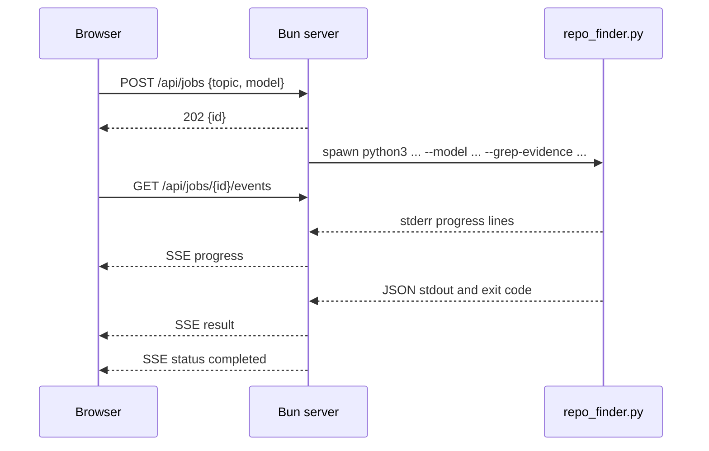

# Local Web and SSE Jobs

> Category: Web | Version: 1.0 | Date: August 2026 | Status: Active

The in-memory job protocol joining the browser, Bun server, and Python search subprocess.

**Related:**
- [System architecture](../architecture/system-architecture.md)
- [Search and retrieval pipeline](../search/search-retrieval-pipeline.md)
- [Provider and credential model](../security/provider-credential-model.md)

---

## Request flow

`POST /api/jobs` requires JSON, normalizes whitespace, enforces a 1–200 character topic and 4 KB body, validates the model against the server allowlist, and returns a UUID with status 202. It rejects new work when ten jobs are currently running. The queued state is brief because `runSearch` starts immediately and sets the job to running.

The worker command invokes `python3 repo_finder.py <topic> --model <approved-id> --grep-evidence benchmarks/grep_evidence.json`, forces the subprocess provider to OpenRouter, and uses the repository root as its working directory. stderr non-empty lines become `progress` events; stdout is collected and parsed as one JSON result.

## SSE behavior

Events use named SSE frames: `status`, `progress`, `result`, and `job-error`. Every event is stored and replayed to later subscribers before live delivery (`server.ts:65-75`, `server.ts:190-213`). The browser uses `EventSource`, renders progress, renders a result event, closes on terminal status, and lets EventSource reconnect after interruption (`public/app.js:159-178`).

## Cancellation and terminal states

`DELETE /api/jobs/{id}` accepts only queued or running jobs. It sets `canceled`, kills the subprocess if assigned, and emits terminal status; completed, failed, or already canceled jobs return 409 (`server.ts:216-223`). The browser exposes cancellation only while busy (`public/app.js:36-40`, `public/app.js:219-227`).

A nonzero worker exit uses the final stderr line as the error when available. Parse, stream-limit, and subprocess failures emit `job-error` followed by failed status (`server.ts:128-150`). Only completed and failed paths schedule deletion after 15 minutes; cancellation returns early from the worker's `try`, but still passes through `finally`, so it is also scheduled.

## HTTP surface

- `GET /`, `/settings`, `/settings/`, `/app.js`, `/settings.js`, `/styles.css` — fixed static allowlist.
- `GET /api/models` — return the approved model catalog and default.
- `POST /api/jobs` — validate the topic and model, then create a search.
- `GET /api/jobs/{id}/events` — subscribe/replay (`server.ts:251-255`).
- `DELETE /api/jobs/{id}` — cancel active work (`server.ts:251-256`).

Unknown paths return 404 and unsupported methods on a known job path return 405 (`server.ts:251-257`).
